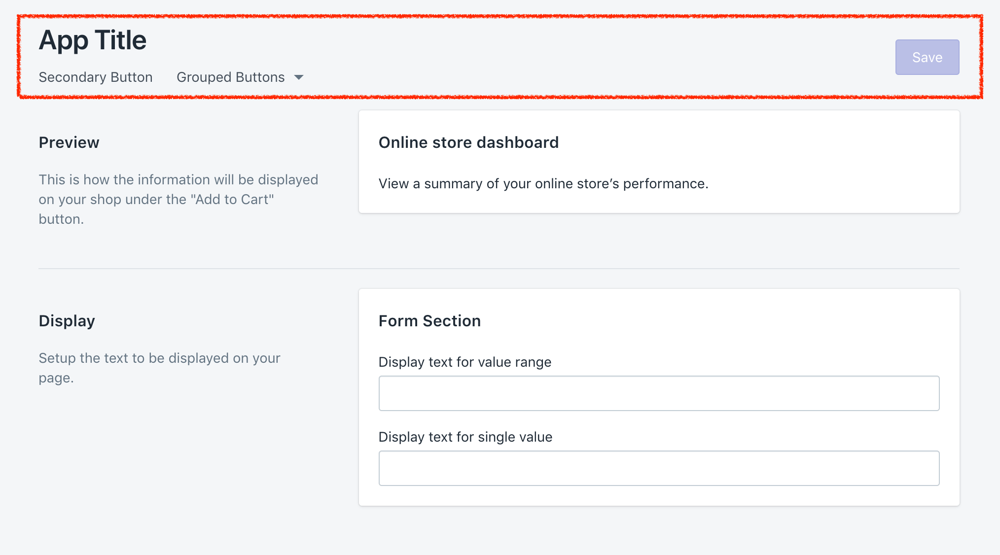
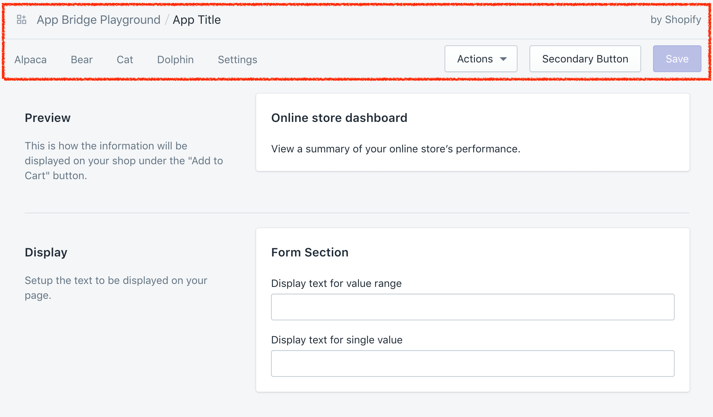
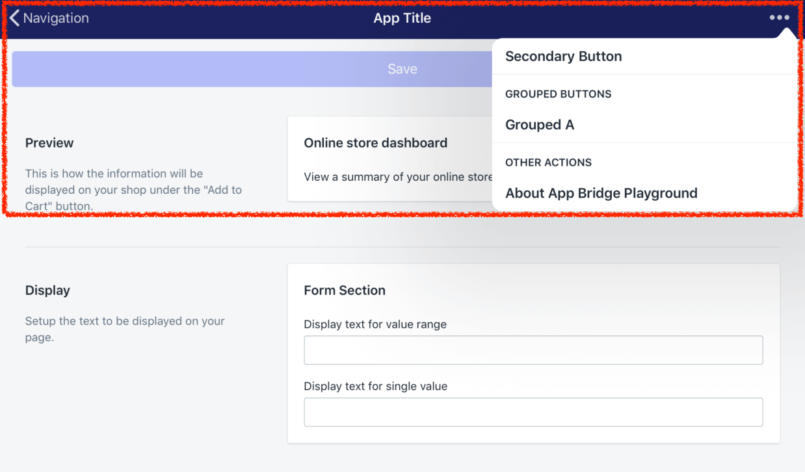

# Test Polaris App Bridge Embedded App

This is an example of a Shopify embedded app created with [Polaris](https://polaris.shopify.com/components/structure/app-provider#section-initializing-the-shopify-app-bridge) with server side rendering.

Context | Screenshot
--- | ---
Standalone | 
Embedded | 
Embedded&nbsp;-&nbsp;Mobile&nbsp;(iOS) | 

## How to Use
With `dev` installed, run: `dev up; dev server`

## Install to shop
Install app by visiting: https://nextjs-app-test.myshopify.io/auth?shop=shop1.myshopify.io

